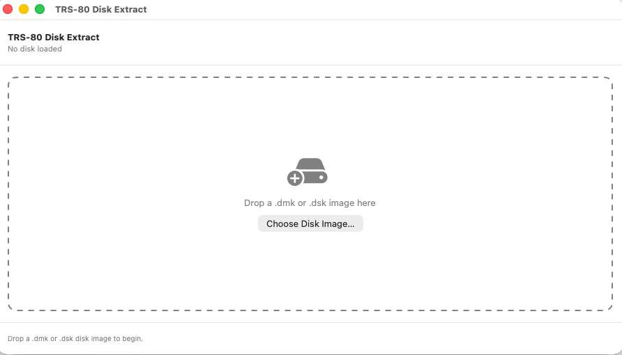
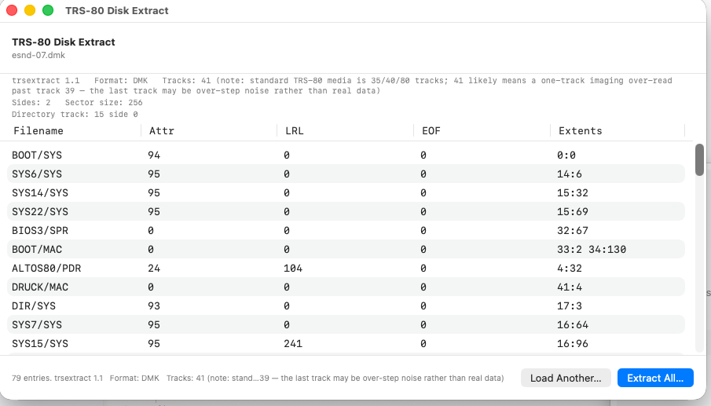
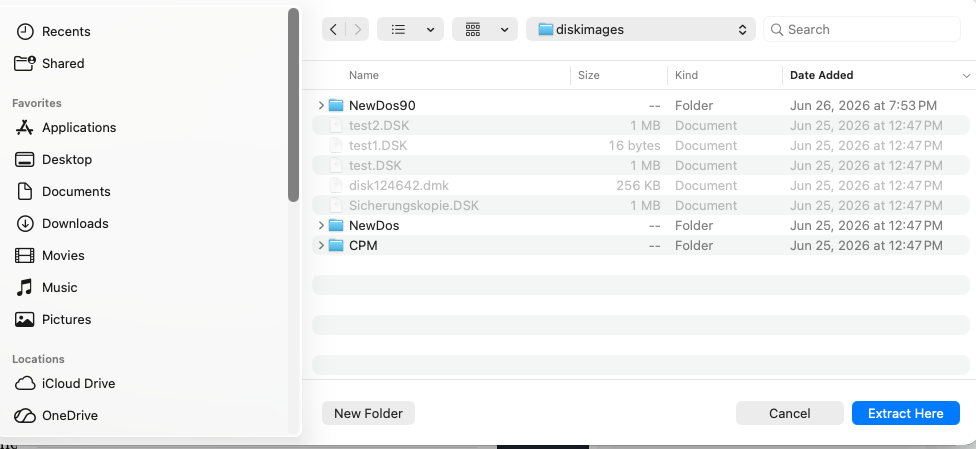

# trsextract

A native, dependency-free reader and extractor for **TRS-80 Model I**
NEWDOS/80 and G-DOS floppy disk images (`.dmk`, `.dsk`). Lists directories and
extracts files **byte-for-byte**, with no emulator, no Windows, and no external
tools required — just Python 3.

Built for the preservation of an original TRS-80 Model I disk collection, and
validated against authoritative TRSTools extractions across multiple disk
geometries.

- **Version:** 1.1
- **License:** GNU General Public License v3 (GPLv3)
- **Requirements:** Python 3 (standard library only — runs on stock macOS,
  Linux, or anywhere Python 3 is available)

This repository also includes an optional **SwiftUI wrapper** that gives the
tool a native drag-and-drop macOS interface (see the end of this README).

---

## Screenshots

The optional SwiftUI wrapper — drop a disk image, browse its directory, and
extract every file with one click.






---

## What it does

- **Lists** the directory of a NEWDOS/80 or G-DOS disk image: filenames,
  attributes, logical record length, EOF offset, and extent allocation.
- **Extracts** every file to a folder, byte-exact, following the on-disk
  granule allocation (including multi-extent and FXDE-continuation files).
- **Auto-detects disk geometry** — sides (1 or 2), sectors per track
  (single- vs double-density), granules per lump, and the reserved offset —
  so no manual configuration is needed across the different disk formats.
- **Identifies hard-disk volume images** and reports them rather than
  mis-decoding them (those require PDRIVE geometry and are not floppy-scannable).

It is **read-only** with respect to disk images: it never modifies the source
`.dmk`/`.dsk`. Extracted files are written only to the output folder you choose.

---

## Quick start

```
python3 trsextract.py DISK.dmk                 # list the directory
python3 trsextract.py DISK.dmk -o OUTDIR/      # extract all files to OUTDIR/
```

Extraction prints the geometry it auto-detected, e.g.:

```
Extracting 22 files to esnd-23_extract/ (sides=2 spt=18 GPL=6 offset=36) ...
```

> **Tip:** avoid spaces in the output folder name, or quote it —
> `-o "my disk/"`. A trailing slash is optional.

---

## Usage

| Option | Meaning |
| --- | --- |
| `image` | Path to the `.dmk` / `.dsk` image (required). |
| `-o`, `--output DIR` | Extract all files to `DIR` (created if absent). Without this, the tool only lists. |
| `--track N` | Force the directory track instead of auto-detecting it. |
| `--detokenize` | (Reserved) de-tokenize BASIC files to ASCII. |
| `-v`, `--verbose` | Show the DMK header and per-track directory-scan scores. |
| `--version` | Print `trsextract 1.1`. |
| `--extract-at START,NSEC,EOF` | Low-level: extract from a known absolute start sector, sector count, and EOF-in-last-sector. For diagnostics. |
| `--self-test` | Run the built-in extraction regression (meaningful only on the `esnd-23` reference disk). |

---

## Supported formats and geometries

Validated byte/CR-exact against authoritative TRSTools extractions across
three distinct geometries:

| Disk class | Sides | Sectors/track | GPL | Offset | Example |
| --- | --- | --- | --- | --- | --- |
| G-DOS single-sided single-density | 1 | 10 | 2 | 0 | esnd-02 |
| NEWDOS double-sided double-density | 2 | 18 | 2 | 36 | esnd-05, esnd-06 |
| NEWDOS double-sided double-density | 2 | 18 | 6 | 36 | esnd-23 |

All four parameters are detected automatically from each image.

File types verified across these disks include BASIC (tokenised and ASCII),
assembler source, JCL, ILF, DAT, DRW, HRG graphics, CMD/COM, REL, SAV, DUM,
and TXT.

---

## Output notes

- **Line endings.** Text files are extracted with the disk's **native bare-CR**
  (`\r`) line endings — exactly as stored on the TRS-80 media. Some other tools
  convert these to CR/LF (`\r\n`); trsextract preserves the original, which is
  more faithful for archival purposes.
- **Filenames.** On-disk `NAME/EXT` becomes `NAME.EXT` on output; a `/` inside a
  name is replaced with `_`.

---

## Known limitations

- **Deleted directory entries.** Some disks contain stale/deleted directory
  slots (type byte with bit 4 clear, absent from the HIT). The lister shows
  them and extraction will produce output from their leftover extent fields,
  but that content may not be a valid live file. The tool deliberately does
  **not** auto-hide them, because neither the type-bit nor HIT-membership test
  is reliable across all disk types (both wrongly drop genuine G-DOS files).
  On the `esnd-23` reference disk, the stale slots are `WBEDIT/COM` and
  `PLANTS` (the live demo file is `PLANT`, singular).
- **Hard-disk volume images** (e.g. `GAMES.DSK`) are detected and reported but
  not extracted; reading them needs the volume's PDRIVE geometry.
- **Untested geometries.** 35-track and other uncommon formats should adapt via
  auto-detection but have not been confirmed against references.

---

## How extraction works (brief)

NEWDOS/80 and G-DOS allocate file data in **granules** (5 sectors each), grouped
into **lumps**. Each directory entry lists extent pairs `(lump, code)` where the
high bits of `code` select the starting granule within the lump and the low 5
bits give the granule count. The absolute start sector is:

```
start_sector = (lump * GPL + startgran) * 5 + offset
```

mapped to physical `(track, side, sector)` according to the disk's sides and
sectors-per-track. Files longer than four extents continue via an FXDE
(extended directory entry) linked from the primary entry. File length comes
from the entry's EOF sector count and EOF byte.

The implementation was cross-checked against the published NEWDOS/80 and TRSDOS
directory format and Klaus Kämpf's `newdos.rb`.

---

## The SwiftUI wrapper (optional)

This repo also includes a small native macOS app that wraps the tool: drop a
`.dmk`/`.dsk`, see the directory in a table, click **Extract All**. It shells
out to `python3 trsextract.py`, so it needs Python 3 on the system.

Build it with:

```
./build.sh
open TRS80Extract.app
```

`build.sh` compiles `Sources/main.swift` (with `swiftc -parse-as-library`),
assembles the `.app` bundle using `Info.plist`, and copies `trsextract.py`
into the bundle's Resources so the app finds it at runtime.

---

## Acknowledgements

- Klaus Kämpf — `newdos.rb`, an independent NEWDOS/G-DOS/TRSDOS reader whose
  format handling confirmed the extent decode and file-size calculation.
- The published Model III TRSDOS directory-format notes for the GAT/HIT/FPDE
  layout.

Disk images and the broader hardware context come from the
[TRS80M1](https://github.com/Egbert-Azure/TRS80M1) preservation project.

---

## License

Copyright (C) 2026 Egbert Schröer

This program is free software: you can redistribute it and/or modify it under
the terms of the GNU General Public License as published by the Free Software
Foundation, either version 3 of the License, or (at your option) any later
version. It is distributed WITHOUT ANY WARRANTY. See the [LICENSE](LICENSE)
file or <https://www.gnu.org/licenses/> for details.