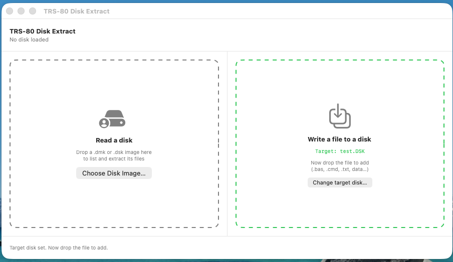
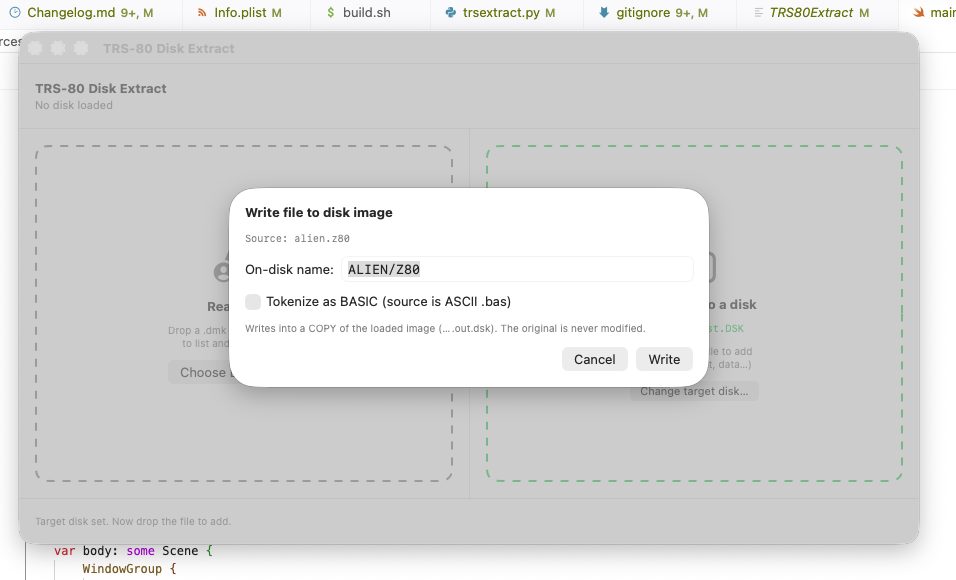
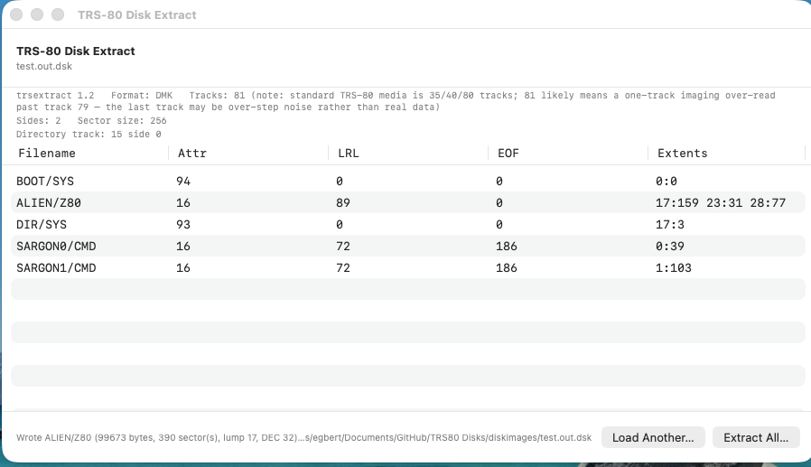

# trsextract

A native, dependency-free reader, extractor, and **writer** for **TRS-80
Model I** NEWDOS/80 and G-DOS floppy disk images (`.dmk`, `.dsk`). Lists
directories and extracts files **byte-for-byte**, and writes host files
(BASIC programs, `/CMD` binaries, text, data) **onto** a disk so they can run
on the emulated Model I — no Windows, no external tools, just Python 3.

Built for the preservation of an original TRS-80 Model I disk collection, and
validated against authoritative TRSTools extractions and against real
NEWDOS/80 in the sdltrs emulator across multiple disk geometries.

- **Version:** 1.3
- **License:** GNU General Public License v3 (GPLv3)
- **Requirements:** Python 3 (standard library only — runs on stock macOS,
  Linux, or anywhere Python 3 is available)

This repository also includes an optional **SwiftUI wrapper** that gives the
tool a native drag-and-drop macOS interface (see the end of this README).

---

## Screenshots

The optional SwiftUI wrapper. The start screen offers two intents side by side
— **read** a disk on the left, **write** a file to a disk on the right.


Reading — drop a `.dmk`/`.dsk` and browse its directory; **Extract All** pulls
every file out to a folder you pick.


Writing — set the target disk (the zone turns green and shows the target),
drop the file to add, confirm the on-disk `NAME/EXT`, and the file is written
into a **copy**.






---

## What it does

- **Lists** the directory of a NEWDOS/80 or G-DOS disk image: filenames,
  attributes, logical record length, EOF offset, and extent allocation.
- **Extracts** every file to a folder, byte-exact, following the on-disk
  granule allocation (including multi-extent and FXDE-continuation files).
- **Auto-detects disk geometry** — sides (1 or 2), sectors per track
  (single- vs double-density), granules per lump, and the reserved offset —
  so no manual configuration is needed across the different disk formats.
- **Identifies hard-disk volume images** and reports them rather than
  mis-decoding them (those require PDRIVE geometry and are not floppy-scannable).
- **Writes a host file onto a disk** (NEWDOS/80 DSDD): a BASIC program from an
  ASCII `.bas` source (tokenised exactly as NEWDOS `SAVE` does), or any file
  verbatim (`/CMD`, `/TXT`, data, source — multi-lump files included). The
  result `LOAD`s and `RUN`s in NEWDOS.

Writes never modify the source image: they go to a **copy**
(`<image>.out.dsk`). Listing and extraction are likewise read-only —
extracted files are written only to the output folder you choose.

---

## Quick start

```
python3 trsextract.py DISK.dmk                 # list the directory
python3 trsextract.py DISK.dmk -o OUTDIR/      # extract all files to OUTDIR/

# write a tokenised BASIC program into a copy of the image
python3 trsextract.py DISK.dmk --write-basic prog.bas --as NAME/BAS -o out.dsk

# write ANY host file verbatim (multi-lump ok) into a copy of the image
python3 trsextract.py DISK.dmk --write-file foo.cmd --as FOO/CMD -o out.dsk
```

Extraction prints the geometry it auto-detected, e.g.:

```
Extracting 22 files to esnd-23_extract/ (sides=2 spt=18 GPL=6 offset=36) ...
```

> **Tip:** avoid spaces in the output folder name, or quote it —
> `-o "my disk/"`. A trailing slash is optional.

---

## Usage

| Option | Meaning |
| --- | --- |
| `image` | Path to the `.dmk` / `.dsk` image (required). |
| `-o`, `--output DIR` | Extract all files to `DIR` (created if absent). Without this, the tool only lists. For write modes, `-o` sets the written copy's path (default `<image>.out.dsk`). |
| `--track N` | Force the directory track instead of auto-detecting it. |
| `--detokenize` | (Reserved) de-tokenize BASIC files to ASCII. |
| `--write-basic SRC.bas` | Tokenise an ASCII BASIC source and write it into a **copy** of the image (NEWDOS/80 DSDD). Use `--as` for the on-disk name. |
| `--write-file SRC` | Write any host file verbatim into a **copy** of the image (`/CMD`, `/TXT`, data, source; multi-lump files supported). Use `--as` for the on-disk name. |
| `--as NAME/EXT` | On-disk filename for `--write-basic` / `--write-file` (defaults derived from the source filename; `/BAS` for `--write-basic`). |
| `-v`, `--verbose` | Show the DMK header and per-track directory-scan scores. |
| `--version` | Print `trsextract 1.3`. |
| `--extract-at START,NSEC,EOF` | Low-level: extract from a known absolute start sector, sector count, and EOF-in-last-sector. For diagnostics. |
| `--self-test` | Run the built-in extraction regression (meaningful only on the `esnd-23` reference disk). |

---

## Supported formats and geometries

Validated byte/CR-exact against authoritative TRSTools extractions across
three distinct geometries:

| Disk class | Sides | Sectors/track | GPL | Offset | Example |
| --- | --- | --- | --- | --- | --- |
| G-DOS single-sided single-density | 1 | 10 | 2 | 0 | esnd-02 |
| NEWDOS double-sided double-density | 2 | 18 | 2 | 36 | esnd-05, esnd-06 |
| NEWDOS double-sided double-density | 2 | 18 | 6 | 36 | esnd-23 |

All four parameters are detected automatically from each image.

File types verified across these disks include BASIC (tokenised and ASCII),
assembler source, JCL, ILF, DAT, DRW, HRG graphics, CMD/COM, REL, SAV, DUM,
and TXT.

---

## Output notes

- **Line endings.** Text files are extracted with the disk's **native bare-CR**
  (`\r`) line endings — exactly as stored on the TRS-80 media. Some other tools
  convert these to CR/LF (`\r\n`); trsextract preserves the original, which is
  more faithful for archival purposes.
- **Filenames.** On-disk `NAME/EXT` becomes `NAME.EXT` on output; a `/` inside a
  name is replaced with `_`.

---

## Known limitations

- **Deleted directory entries.** Some disks contain stale/deleted directory
  slots (type byte with bit 4 clear, absent from the HIT). The lister shows
  them and extraction will produce output from their leftover extent fields,
  but that content may not be a valid live file. The tool deliberately does
  **not** auto-hide them, because neither the type-bit nor HIT-membership test
  is reliable across all disk types (both wrongly drop genuine G-DOS files).
  On the `esnd-23` reference disk, the stale slots are `WBEDIT/COM` and
  `PLANTS` (the live demo file is `PLANT`, singular).
- **Hard-disk volume images** (e.g. `GAMES.DSK`) are detected and reported but
  not extracted; reading them needs the volume's PDRIVE geometry.
- **Untested geometries.** 35-track and other uncommon formats should adapt via
  auto-detection but have not been confirmed against references.

---

## How extraction works (brief)

NEWDOS/80 and G-DOS allocate file data in **granules** (5 sectors each), grouped
into **lumps**. Each directory entry lists extent pairs `(lump, code)` where the
high bits of `code` select the starting granule within the lump and the low 5
bits give the granule count. The absolute start sector is:

```
start_sector = (lump * GPL + startgran) * 5 + offset
```

mapped to physical `(track, side, sector)` according to the disk's sides and
sectors-per-track. Files longer than four extents continue via an FXDE
(extended directory entry) linked from the primary entry. File length comes
from the entry's EOF sector count and EOF byte.

The implementation was cross-checked against the published NEWDOS/80 and TRSDOS
directory format and Klaus Kämpf's `newdos.rb`.

---

## How writing works (brief)

Writing reverses the same model and was built from Klaus Kämpf's `newdos.rb`
and the NEWDOS/TRSDOS directory spec, then validated against files NEWDOS
itself wrote and by loading the results in sdltrs (`LOAD`, `LIST`, `RUN` all
succeed). The pieces that have to be exact:

- **Directory Entry Code (DEC).** A directory slot is addressed by
  `dec = (rrr << 5) + sssss`, where `sssss` selects the entry sector and `rrr`
  the 32-byte slot within it. The **HIT byte for a file lives at offset == DEC**
  — not a linear slot index. (Getting this wrong lets `DIR` list the file while
  `LOAD` rejects it as "not in directory".)
- **Entry layout.** byte 3 = EOF byte in the last sector, bytes 20-21 = EOF
  relative-sector count, bytes 16-19 = update/access hash, bytes 22+ = extent
  pairs `(lump, (startgran<<5)|(ngran-1))`, terminated by `0xFF`.
- **HIT hash.** XOR-rotate over the 11-byte name+ext (matches NEWDOS).
- **DMK CRC.** Each written sector's data-field CRC is regenerated as
  CRC-16-CCITT (preset `0xFFFF`) over the `A1 A1 A1` sync + data-address-mark +
  data — validated against thousands of NEWDOS-written sectors.
- **Multi-lump files.** Granules are numbered continuously across the disk, so
  a file larger than one lump is placed in a contiguous run of free granules
  and described by a single extent that spans lumps; the GAT bits are marked
  across every spanned lump. A 9032-byte `SARGON0/CMD` written this way to a
  blank disk loads and runs.

BASIC sources are tokenised into the exact byte stream NEWDOS BASIC `SAVE`
produces (the `0xFF` marker, per-line `[next-ptr][line-no][tokens][00]` records,
`00 00` terminator), so `LOAD`/`LIST`/`RUN` behave as if NEWDOS had saved them.

**Write scope (v1).** Writes append into free space, on a copy — no overwrite,
delete, or defragment. A file needs a single **contiguous** run of free
granules. That run may be large: it is described by up to four extent pairs
(each extent's granule count is a 5-bit field, max 32 granules), so files that
need more than four extents are rejected (those would require FXDE continuation
entries). Validated at scale on real NEWDOS: a 99 673-byte, 3-extent file
(`ALIEN/Z80`) written from the host appears in `DIR` on a real boot. Target
geometry is **NEWDOS/80 DSDD**; other geometries are read fine but not yet
write targets.

---

## The SwiftUI wrapper (optional)

This repo also includes a small native macOS app that wraps the tool. Its
start screen offers two intents side by side:

- **Read a disk** — drop a `.dmk`/`.dsk` (or use the picker) to list the
  directory in a table and **Extract All**.
- **Write a file to a disk** — choose or drop the target disk, then drop the
  file to add. A naming sheet appears (pre-filled `NAME/EXT`, with a
  *Tokenize as BASIC* toggle auto-selected for `.bas`). The file is written
  into a COPY (`<target>.out.dsk`); the original disk is never modified, and
  the app then shows the resulting image's listing.

It shells out to `python3 trsextract.py`, so it needs Python 3 on the system.

Build it with:

```
./build.sh
open TRS80Extract.app
```

`build.sh` compiles `Sources/main.swift` (with `swiftc -parse-as-library`),
assembles the `.app` bundle using `Info.plist`, and copies `trsextract.py`
into the bundle's Resources so the app finds it at runtime.

---

## Writing a file to a disk — the safe workflow

Reading is one-directional and harmless. Writing changes a disk's contents, so
it follows a deliberate, **copy-first** model designed for archival work: the
tool never writes into your original image. Understanding this is the point of
this section.

### The safety model: copy side by side, never touch the original

Every write makes a **new** image next to the target and adds the file there:

```
test_copy.dmk            ← your target disk (read, then duplicated; UNCHANGED)
test_copy.out.dsk        ← the copy, with your file added
```

Concretely, `--write-file` / `--write-basic`:

1. **Copy** the target image byte-for-byte to `<target>.out.dsk` (or whatever
   `-o` you pass). The original file on disk is opened read-only and is never
   modified.
2. **Operate only on the copy** — allocate free granules, write the file's
   data sectors (regenerating each DMK sector CRC), add the 32-byte directory
   entry, set the HIT hash, and mark the GAT.
3. Leave the original exactly as it was. If anything goes wrong mid-write, the
   damage is confined to the disposable `.out.dsk`; your archived disk is safe.

So the correct mental model is **duplicate-then-add**, not edit-in-place. You
can diff the two files, boot the copy in an emulator, and only if it's good
promote it — your master image is never at risk. This is why the app reloads
the listing from the **`.out.dsk`** after writing: what you see is the copy,
proving the file landed without ever having touched the source.

### Command line, step by step

Write a tokenised BASIC program:

```text
python3 trsextract.py test_copy.dmk \
        --write-basic basictool.bas --as MYPROG/BAS -o ready.dsk
```

Write any other file verbatim (binary `/CMD`, text, data, source):

```text
python3 trsextract.py test_copy.dmk \
        --write-file game.cmd --as GAME/CMD -o ready.dsk
```

- `test_copy.dmk` — the **target** disk. Read-only; never altered.
- `--write-basic` / `--write-file` — the host file to add. `--write-basic`
  tokenises ASCII BASIC into the exact stream NEWDOS `SAVE` produces;
  `--write-file` copies the bytes verbatim.
- `--as NAME/EXT` — the on-disk filename (8.3, upper-cased). If omitted it is
  derived from the source filename.
- `-o ready.dsk` — the output copy. Omit it and the copy is `<target>.out.dsk`.

Then in the emulator (sdltrs), mount the **output** image and:

```text
DIR :1                       (the file should be listed)
LOAD "MYPROG/BAS:1"  / RUN   (BASIC)         — or —
GAME/CMD:1                   (run a /CMD)
```

### In the app

1. On the start screen, use the right-hand **Write a file to a disk** zone.
2. **Step 1 — choose the target disk.** Click *Choose Target Disk…* or drop a
   `.dmk`/`.dsk`. The zone turns **green** and shows the target name.
3. **Step 2 — drop the file to add** (`.bas`, `.cmd`, `.txt`, data…). A sheet
   opens with the on-disk `NAME/EXT` pre-filled and a *Tokenize as BASIC*
   toggle (auto-checked for `.bas`).
4. Click **Write**. The tool writes `<target>.out.dsk`, the app loads that copy
   so you can see the new file in the listing, and Finder reveals it.

The target and the disk you may be *reading* on the left are independent — you
typically read one disk (say `esnd-23`) while writing onto a blank one.

### What it can and cannot do (write)

- **Geometry:** NEWDOS/80 DSDD only. Other formats (G-DOS, single-density) are
  read fine but are not yet write targets.
- **Allocation:** the file goes into a single **contiguous** run of free
  granules, described by up to four extent pairs (so large files are fine —
  a 99 KB, 3-extent file is validated on real NEWDOS). Files needing more than
  four extents, or a disk with no contiguous run big enough, are **rejected
  with a clear error**, never written partially.
- **Append only:** writes add a file into free space. No overwrite, delete,
  rename, or defragment in this version.
- **Always a copy:** the source image is never modified.

---

## Acknowledgements

- Klaus Kämpf — `newdos.rb`, an independent NEWDOS/G-DOS/TRSDOS reader whose
  format handling confirmed the extent decode and file-size calculation.
- The published Model III TRSDOS directory-format notes for the GAT/HIT/FPDE
  layout.

Disk images and the broader hardware context come from the
[TRS80M1](https://github.com/Egbert-Azure/TRS80M1) preservation project.

---

## License

Copyright (C) 2026 Egbert Schröer

This program is free software: you can redistribute it and/or modify it under
the terms of the GNU General Public License as published by the Free Software
Foundation, either version 3 of the License, or (at your option) any later
version. It is distributed WITHOUT ANY WARRANTY. See the [LICENSE](LICENSE)
file or <https://www.gnu.org/licenses/> for details.